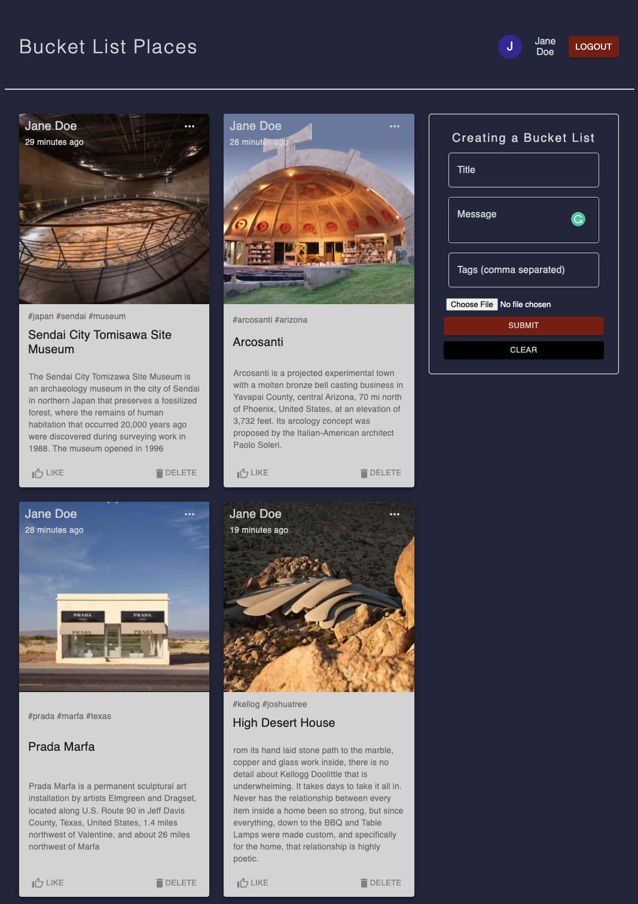

# Bucket List Places
## Introduction
This is a full-featured social app where people can share the places they want to visit someday. People can register their account using GoogleAuth or JSON Web Token (email and password). Once they logged in, they can create, read, update, delete their posts. Also, users can react to others' posts by liking them.

 

## Features
- Create, read, delete, edit user's comment.
- Register user using Google Auth or Email and password
- Reaction to the posts
- Reliable UI design
- Responsive
- Login info will be stored for 1 hour. 

# Development
## Tools and Technologies

- React
- Redux
- Node
- Express
- API
- Google Auth
- JSON web token
- Material UI
- Mongo DB cloud atlas
- Heroku CLI
- Netlify CLI

## Demo
The client-side is deployed on Netlify, and the server-side is on Heroku.
This is the [deployd demo site](https://bucketlistplaces.netlify.app/)